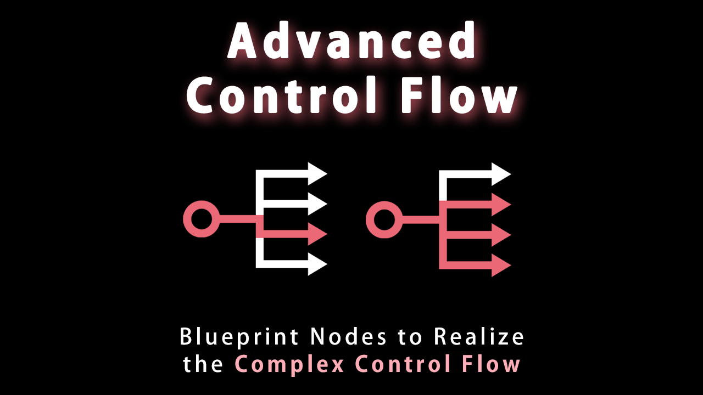

# Unreal Engine Plugin: Advanced Control Flow

Advanced Control Flow is a Unreal Engine plugin which adds Blueprint nodes to realize the complex control flow.

The typical use case of this plugin is when you try to realize the if-elseif-else statement.  
To realize if-elseif-else statement on the vanilla Unreal Engine, you need to stack the multiple branch nodes to check multiple conditions.  
By using this plugin, you can realize this case with only one MultiBranch node.

## Features

* MultiBranch
  * Realize if-elseif-else statement (multiple conditional branches).
* Conditional Sequence
  * Execute each relevant execution pins if each conditional pin is true.

## Supported Environment

This plugin supports on the below environment.

* Unreal Engine Version: 4.26 / 4.27 / 5.0
* Development Platforms: Windows / macOS / Linux
* Target Build Platforms: All platforms

## Installation

This plugin is basically free.  
See [the document](docs/installation.md) if you want to install a free version.

## Tutorial

See [the tutorial document](docs/tutorial.md).

## Change Log

See [CHANGELOG.md](CHANGELOG.md).

## Bug Report / Feature Request / Disscussions

If you want to report problems or request features, please [make issues](https://github.com/colory-games/UEPlugin-AdvancedControlFlow/issues).  
You can also discuss about this plugin at [Discord](https://discord.gg/F9cRxfAuJd).

## Project Author

### Owner

This project is owned by the members of [Colory Games](https://colory-games.net/).  
The maintainer of this project is as follows.

|Name|Contact|
|---|---|
|[**@nutti**](https://github.com/nutti)|[Website (Japanese Only)](https://colorful-pico.net/) \| [Twitter](https://twitter.com/nutti__)|
