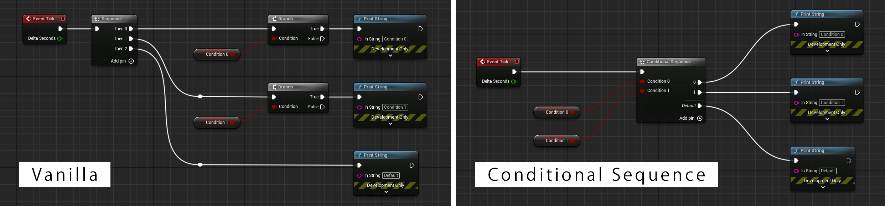

# Tutorial

**Introduction Video**

[](https://www.youtube.com/watch?v=c9moKtYbnvA)

## Multi-Branch

Multi-Branch node realizes multiple conditional branches (like if-elseif-else statement).  
Comparision to the implementation on the vanilla Unreal Engine is as follows.


### Usage

1. Search and place Multi-Branch node on the Blueprint editor.
2. Click [Add Pin] to add a pin pair (condition and execution).
3. Build a logic by connecting among the nodes.

### Comparison to C++ code


Above Blueprint is same as below code in C++.

```cpp
if (Condition_0) {
    UKismetSystemLibrary::PrintString(GEngine->GetWorld(), "Condition 0");
} else if (Condition_1) {
    UKismetSystemLibrary::PrintString(GEngine->GetWorld(), "Condition 1");
} else {
    UKismetSystemLibrary::PrintString(GEngine->GetWorld(), "Default");
}
```

### Additional Info

* Some useful menu for adding/removing pins by right mouse click on the Multi-Branch node.

## Conditional Sequence

Conditional Sequence node execute each relevant execution pins if each conditional pin is true.  
Comparision to the implementation on the vanilla Unreal Engine is as follows.



### Usage

1. Search and place Conditional Sequence node on the Blueprint editor.
2. Click [Add Pin] to add a pin pair (condition and execution).
3. Build a logic by connecting among the nodes.

### Comparison to C++ code


Above Blueprint is same as below code in C++.

```cpp
if (Condition_0) {
    UKismetSystemLibrary::PrintString(GEngine->GetWorld(), "Condition 0");
}
if (Condition_1) {
    UKismetSystemLibrary::PrintString(GEngine->GetWorld(), "Condition 1");
}
UKismetSystemLibrary::PrintString(GEngine->GetWorld(), "Default");
```

### Additional Info

* Some useful menu for adding/removing pins by right mouse click on the Conditional Sequence node.

## Multi-Conditional Select

Multi-Conditional Select node returns the option where the condition is true firstly.
Comparison to the implementation on the vanilla Unreal Engine is as follows.

### Usage

1. Search and place Multi-Conditional Select node on the Blueprint editor.
2. Click [Add Pin] to add a pin pair (option and condition).
3. Build a logic by connecting among the nodes.

### Additional Info

* Some useful menu for adding/removing pins by right mouse click on the Conditional Sequence node.
